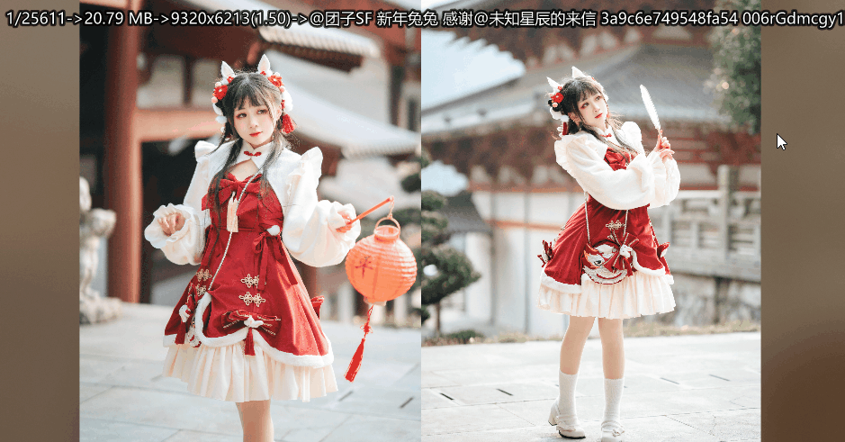
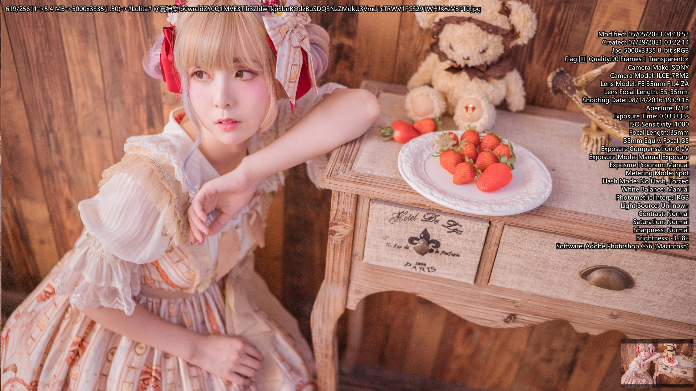
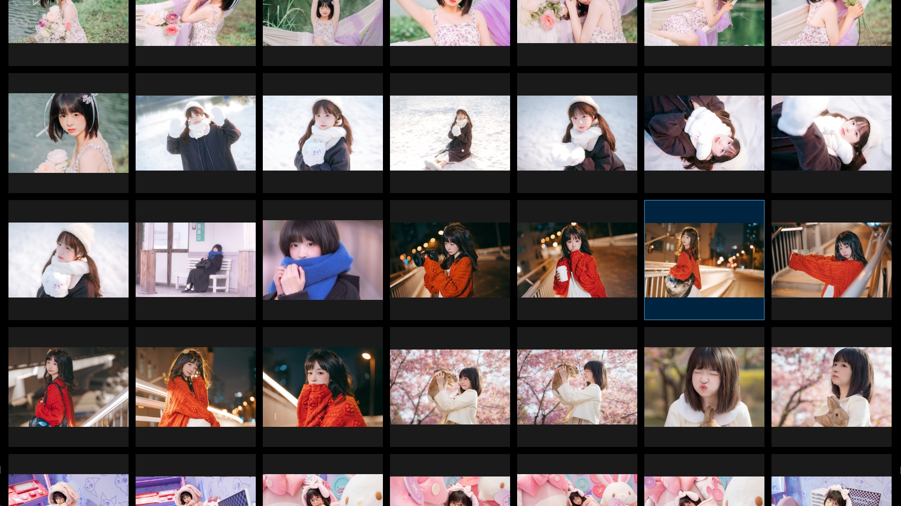
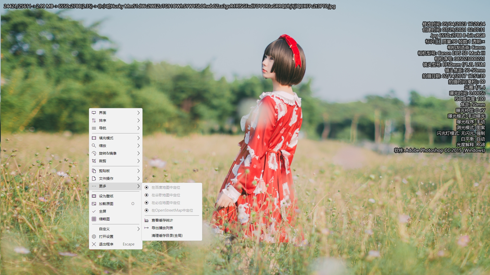
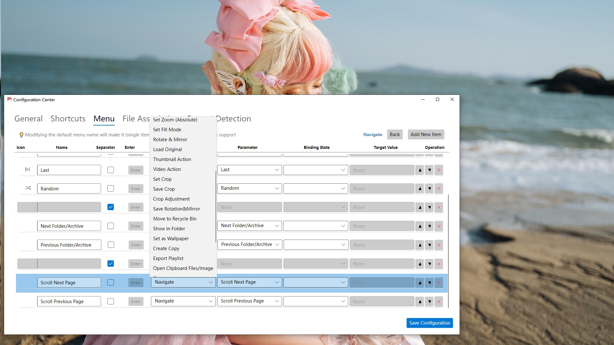
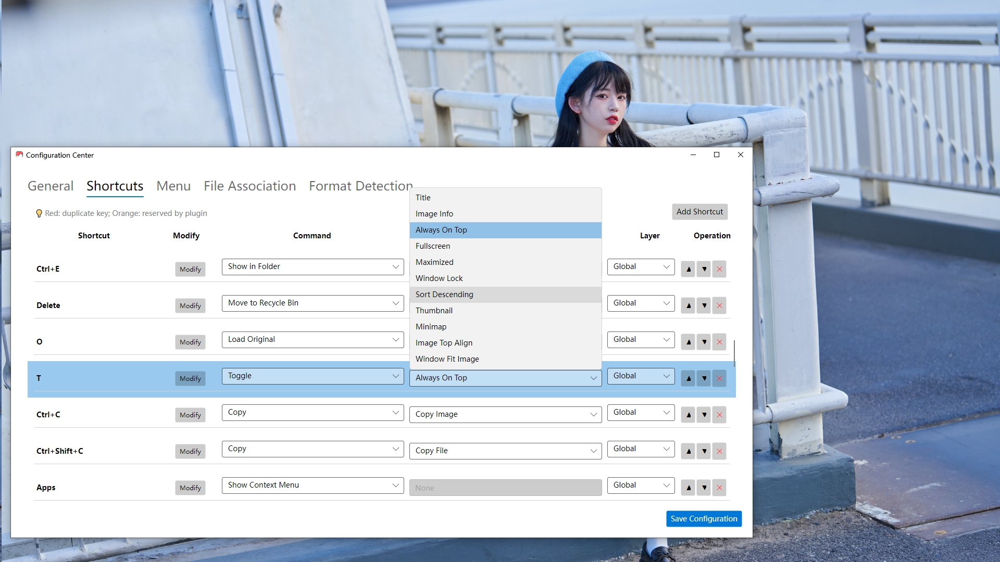
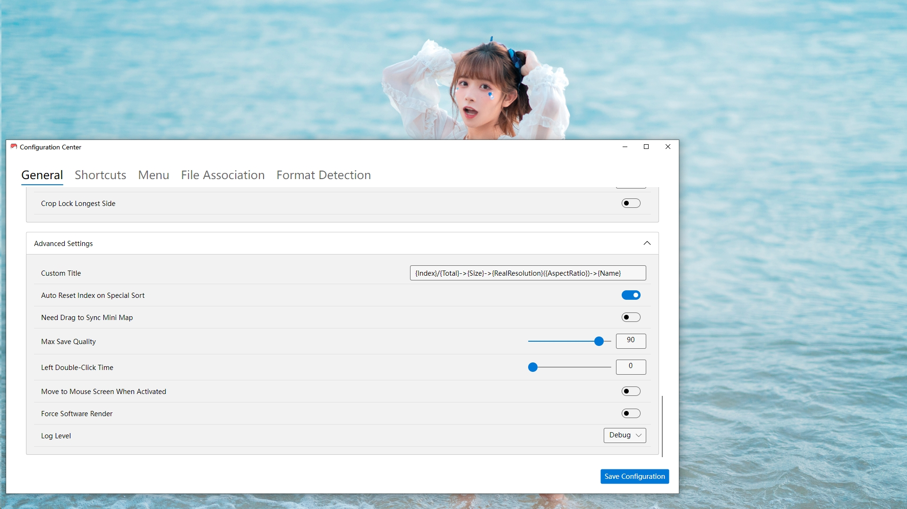

[中文版本](./zh_README.md)

# Vii3
> A high-performance frameless image viewer based on Avalonia, delivering ultra-smooth switching experience, comprehensive format support, and high customizability.
A hobby project developed in isolation
Created to solve the blocking issue when switching between large images

## Features
- Avalonia AOT compilation for extreme startup speed
- Highly optimized loading process ensuring smooth switching without blocking
    - Ensures excellent experience even on mechanical hard drives
- Highly optimized thumbnail support
- Full image format support powered by SkiaSharp and Magick.Net
- Dynamic Gif, Webp, Apng, Jxl, Avif support
- Android live photo support powered by Libmpv
   - You need to download `libmpv-2.dll` yourself and place it in the program directory
   - Most people don't need this, and `libmpv` is quite large, download it yourself if needed
- Zip, Rar archive format support powered by SharpCompress
- Advanced Lua scripting support powered by NLua
- All interface elements can be removed to eliminate browsing distractions
- Fully customizable keyboard shortcuts and right-click menus
- Multi-language support can be created and updated by users
    - Create new in settings interface
    - Export untranslated items
    - Have AI translate and copy
    - Import

## Screenshots

## Other
  - [Why 3? Because there was a predecessor](https://meta.appinn.net/t/topic/35989/)
  - [Documentation](Documentation.md)
  - [Lua Documentation](Lua-Documentation.md)
  - [Known Issues](Known-Issues.md)
  - Strongly recommend setting `Decode Width` to approximately 1.5-2x your screen width
    - Greatly improves large image loading speed and reduces moiré patterns
    - Only supports `SkiaSharp` formats: `.bmp`, `.jpg`, `.jpeg`, `.png`, `.webp`, `.gif`, `.ico`, `.wbmp`

## Dependencies
 - [Avalonia](https://avaloniaui.net/)
 - [Magick.NET](https://github.com/dlemstra/Magick.NET)
 - [NLua](https://github.com/nlua/NLua)
 - [SharpCompress](https://github.com/adamhathcock/sharpcompress)
 - [Microsoft.Data.Sqlite](https://docs.microsoft.com/dotnet/standard/data/sqlite/)
 - [CommunityToolkit.Mvvm](https://github.com/CommunityToolkit/dotnet)
