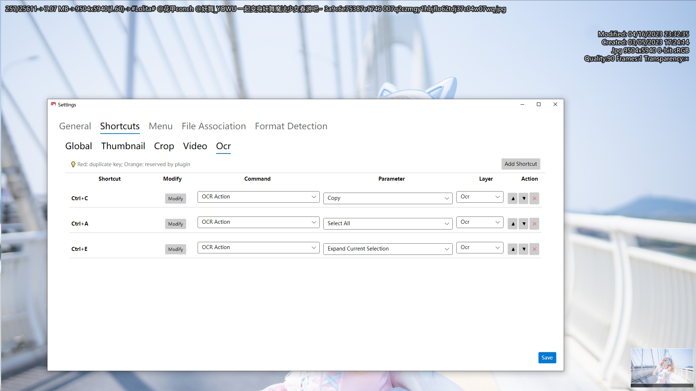
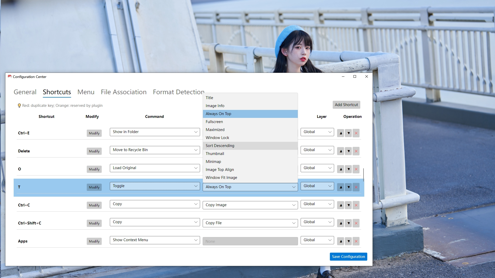
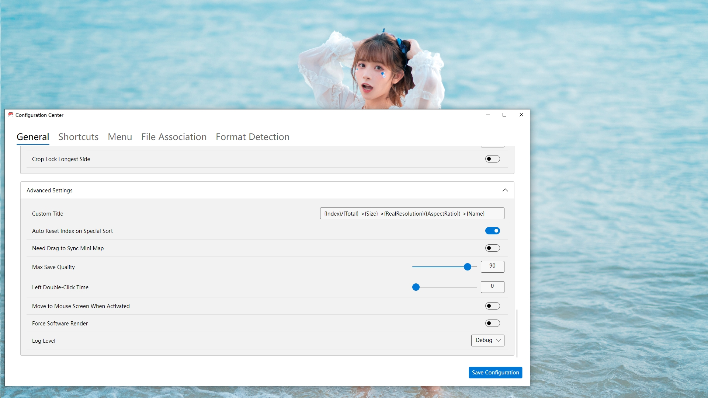

# Vii3
> A high-performance frameless image viewer based on Avalonia, delivering ultra-smooth switching experience, comprehensive format support.
---
## Features
- Avalonia AOT compilation for extreme startup speed
- Highly optimized loading process ensuring smooth switching without blocking
    - Ensures excellent experience even on mechanical hard drives
- Full image format support powered by SkiaSharp and Magick.Net
- Animation Gif, Webp, Apng, Jxl, Avif support
- Zip, Rar, Cbz, Cbr archive format support powered by SharpCompress
- Advanced Lua scripting support powered by Lua-CSharp
- Live photo support
- OCR Support (Testing)
   - Need to download models according to the document
- All interface elements can be removed to eliminate browsing distractions
- Fully customizable keyboard shortcuts and contextmenu
- Multi-language support can be created and updated by users
    - Create new in settings interface
    - Export untranslated items
    - Have AI translate and copy
    - Import
---
## Screenshots

---
## Other
  - [Why 3? Because there was a predecessor](https://meta.appinn.net/t/topic/35989/)
  - [Documentation](Documentation.md)
  - [Known Issues](Known-Issues.md)
  - The Lua and Effects documents are AI-generated artifacts meant to be consumed by AI — **not for human reading**. They may differ from the Chinese versions (which are the canonical source). To extend or customize, have AI read the Chinese versions directly:
    - [Lua Documentation (Chinese)](zh_Lua-Documentation.md)
    - [Effects Documentation (Chinese)](zh_Effects-Documentation.md)
---
## Dependencies
 - [Avalonia](https://avaloniaui.net/)
 - [Magick.NET](https://github.com/dlemstra/Magick.NET)
 - [Lua-CSharp](https://github.com/nuskey8/Lua-CSharp)
 - [SharpCompress](https://github.com/adamhathcock/sharpcompress)
 - [Microsoft.Data.Sqlite](https://docs.microsoft.com/dotnet/standard/data/sqlite/)
 - [CommunityToolkit.Mvvm](https://github.com/CommunityToolkit/dotnet)
 - [Microsoft.Windows.CsWin32](https://github.com/microsoft/CsWin32)
 - [Vii3Media](https://github.com/vvyoko/Vii3Media)
