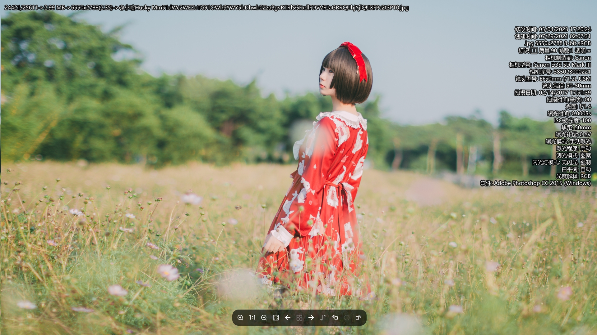
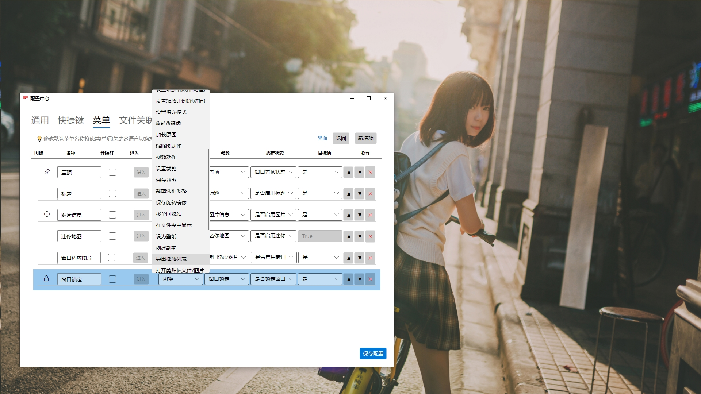
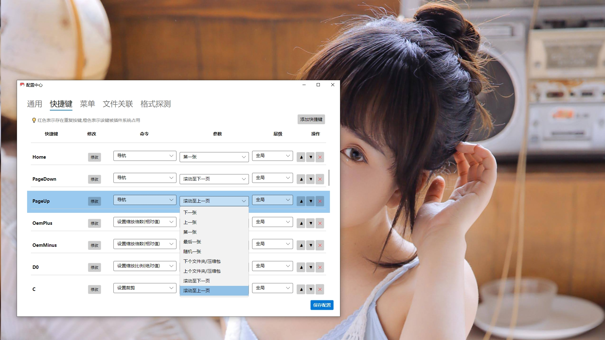
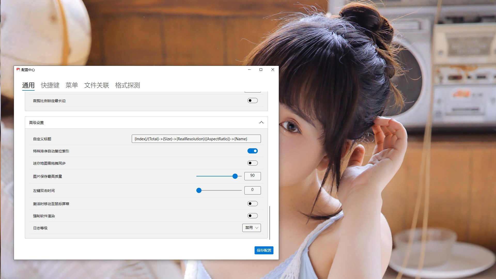

# Vii3
> 基于 Avalonia 的高性能图片无边框浏览器，极致流畅的切换体验，全面的格式支持。
古法编程闭门造车之作
为了解决大图切换时的阻塞而产生
---
## 特性
- Avalonia AOT 编译带来极致的启动速度
- 高度优化的加载流程，确保切换无阻塞
    - 保证机械硬盘仍有优秀体验
- 由 SkiaSharp 及 Magick.Net 驱动，全图片格式支持
- 动图 Gif，Webp，Apng，Jxl，Avif
- 由 Libmpv 驱动 实现动态照片支持
   - 需自行下载 `libmpv-2.dll` 放置程序所在目录
   - 大部分人无此需求,且 `libmpv` 比较大 ,需要的自行下载
- 由 SharpCompress 驱动带来 Zip，Rar, Cbz, Cbr 压缩包格式支持
- 由 NLua 驱动带来 高级需求 lua 支持
- 界面元素可全部移除以去除对浏览的干扰
- 快捷键，右键菜单可完全自定义
- 多语言可由用户完成生成,更新
    - 设置界面新建
    - 导出未翻译
    - 交由AI翻译并复制
    - 导入即可
---
## 展示

---
## 其他
  - [为什么是3，因为有前作](https://meta.appinn.net/t/topic/35989/)
  - [文档](zh_Documentation.md)
  - [Lua文档](zh_Lua-Documentation.md)
  - [已知问题](zh_Known-Issues.md)
  - 强烈建议设置`解码宽度`为屏幕宽度 1.5-2 倍左右
    - 大幅提升大图读取速度
    - 仅支持 `SkiaSharp` 格式 `.bmp`, `.jpg`, `.jpeg`, `.png`,  `.webp`, `.gif`, `.ico`, `.wbmp`
---

## 引用
 - [Avalonia](https://avaloniaui.net/)
 - [Magick.NET](https://github.com/dlemstra/Magick.NET)
 - [NLua](https://github.com/nlua/NLua)
 - [SharpCompress](https://github.com/adamhathcock/sharpcompress)
 - [Microsoft.Data.Sqlite](https://docs.microsoft.com/dotnet/standard/data/sqlite/)
 - [CommunityToolkit.Mvvm](https://github.com/CommunityToolkit/dotnet)

